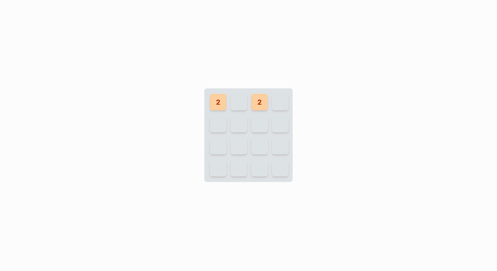

# 2048 Game

This is a simple implementation of the popular 2048 game, built using React and TypeScript.

## Getting Started

To run this app locally, follow these steps:

1. Clone the repository to your local machine.
2. Open a terminal and navigate to the project directory.
3. Run the command `npm install` to install dependencies.
4. Run the command `npm run dev` to start the app.
5. Open your web browser and navigate to `http://localhost:5173`.

## How to Play

The goal of the game is to combine numbered tiles on a 4x4 grid in order to create a tile with the number 2048. Each turn, you can swipe the tiles in one of four directions (up, down, left, or right). If two tiles with the same number collide, they will merge into a single tile with a value equal to their sum. After each move, a new tile will appear on the board with a value of either 2 or 4.

If there are no more possible moves (i.e., the board is full and no adjacent tiles have the same number), the game is over and you lose.

## About

This app was created using ChatGPT, a large language model trained by OpenAI, and its code was generated using the GPT-3.5 architecture. 

Enjoy playing!
